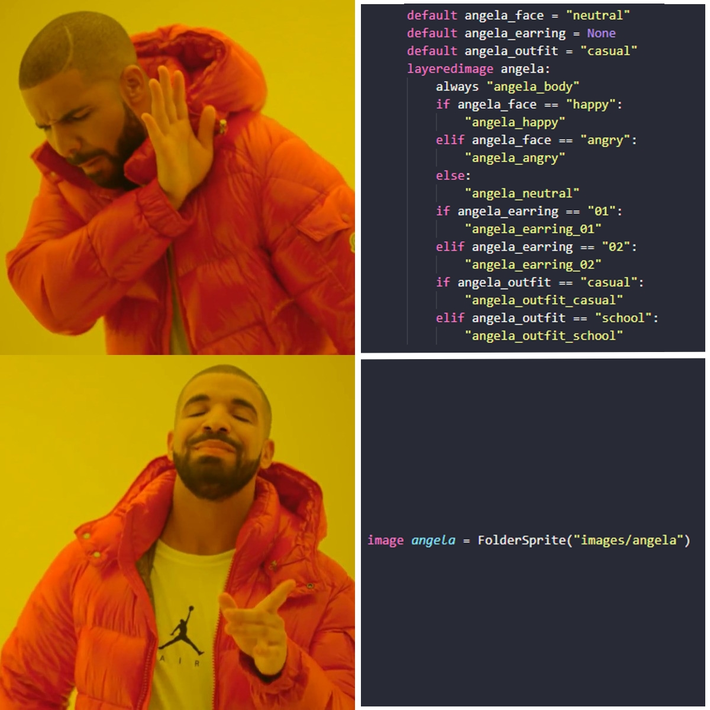

<br></br>

# FolderSprite :open_file_folder:

FolderSprite is the easy solution when you have a sprite with a wide range of images.

FolderSprite is an abstraction of LayeredImage (Ren'Py's default solution). Different from a default Layeredimage, FolderSprite uses a root folder given by the user to define and map the attributes and images of a sprite automatically and thus create a LayeredImage.

## Requirements :hand:

- Only works with **Ren'Py version 8.0.0** or higher.
- Only supports images in **.png** or **.webp** format.

## Installation :arrow_down_small:

Download the repository and extract everything inside the game folder to your project's game folder. It's done!

## FolderSprite class and usage examples :page_facing_up:

### class **FolderSprite**(`folder_path`, `sort` = [], `attributes` = [], `sort_together` = False, `auto_attributes` = False, `**properties`)

This will generate an image-like object that can be used as a displayable.

#### `folder_path` param

A string containing the path where the sprite images are located.

Every image inside the `folder_path` directory will be considered a **base image** for the sprite, which means that it will always appear when the sprite is shown.

Every folder inside the `folder_path` directory will be considered an **image group**. An image group can become an **attribute group** when defined by the user.

```python
image clara = FolderSprite("images/clara") # defining clara sprite
```

#### `sort` param

A string or string list that contain(s) the element(s) you want to be in front of the sprite. These elements can be the name of image group or base image.

```python
image clara = FolderSprite(
    "images/clara",
    sort = ["face", "outfit"]) # making sure that the face always appears on the front of the outfit
```

#### `attributes` param

A string or string list that contains the name(s) of the image group(s) that will be defined as attribute group(s).

When an image group is defined as an attribute group, all the images in that group become attributes.

```python
image clara = FolderSprite(
    "images/clara",
    sort = ["face", "outfit"],
    attributes = ["face", "outfit"]) # the image groups face and outfit are now attribute groups
```

#### `sort_together` param

If True, sorts all base images, image groups and attribute groups on the same layer.

There are **3 layers** in the sprite and these are:

- **Base images**
- **Image groups**
- **Attribute groups**

By default the Attribute groups always come first, then the Image groups and finally the Base images.

If you want to use the `sort` parameter to set a base image to appear in front of a image/attribute group, `sort_together` must be defined as True.

```python
image clara = FolderSprite(
    "images/clara",
    sort = ["face", "left_arm", "outfit"], # left_arm is a base image that will be positioned in front of the outfit attribute group
    attributes = ["face", "outfit"],
    sort_together = True) # defining sort_together to True
```

#### `auto_attributes` param

If True, defines all image groups as attribute groups automatically.

```python
image clara = FolderSprite(
    "images/clara",
    sort = ["face", "left_arm", "outfit"],
    auto_attributes = True, # the face and outfit image groups will be defined automatically as attribute groups
    sort_together = True)
```

#### Default keywords

An image group can have a default image that will be displayed as soon as the sprite is shown for the first time. This default image can be defined in two ways:

If an image within the image group has the name "default", it will be used as the default image for the image group, i.e. when the sprite is shown for the first time, the default image of an image group will be shown along with it. This is not valid for attribute groups.

Another way to set an image as the default within an image/attribute group is to pass the group name keyword and set it as the image name, for example:

```python
image clara = FolderSprite(
    "images/clara",
    sort = ["face", "left_arm", "outfit"],
    auto_attributes = True,
    sort_together = True,
    face = "happy", # now the happy image is the face group's default image
    outfit = "casual") # now the casual image is the outfit group's default image

label start:
    show clara # displaying clara with happy face and casual outfit
    "Clara likes this outfit."
```

#### Other keywords

Any other keywords will be interpreted as [transform properties](https://www.renpy.org/doc/html/atl.html#list-of-transform-properties) for the entire sprite.

```python
image clara = FolderSprite(
    "images/clara",
    sort = ["face", "left_arm", "outfit"],
    auto_attributes = True,
    sort_together = True,
    face = "happy",
    outfit = "casual",
    xpos = 200) # We move our sprite a little to the right
```

You can also apply transform properties to only one image or image/attribute group. To do this, you need to use the following pattern:

    [base image or group]_[transform property] = value
    [group]_[image from the group]_[transform property] = value

```python
image clara = FolderSprite(
    "images/clara",
    sort = ["face", "left_arm", "outfit"],
    auto_attributes = True,
    sort_together = True,
    face = "happy",
    outfit = "casual",
    xpos = 200,
    face_xpos = 100, # we moved our entire face attribute group a little to the right
    left_arm_zoom = 1.3, # we zoom in on our base image left_arm
    outfit_casual_blur = 2.3) # we applied a blur only to the casual image of the outfit attribute group
```

## Manipulating image groups :bookmark_tabs:

By default Ren'Py already gives us a way to manipulate the attributes of the sprite that is being projected onto the screen, but how do we manipulate a group of images that is not an attribute group?

This is easy, just use the **fschange** statement or, if you prefer, the python function **fsc**:

    fschange [image] [image group] [image from the group]
    fsc("[image]").[image group] = "[image from the group]"

```python
image clara = FolderSprite(
    "images/clara",
    sort = ["face", "left_arm", "outfit"],
    attributes = "face", # we are no longer considering outfit as an attribute group.
    sort_together = True,
    face = "happy",
    outfit = "school", # school is now the default image of the outfit group
    xpos = 200,
    face_xpos = 100,
    left_arm_zoom = 1.3,
    outfit_casual_blur = 2.3)

label start:
    show clara # displaying clara with happy face and school outfit
    "Clara likes this outfit."

    fschange clara outfit casual # defining outfit as casual

    show clara sad # displaying clara with sad face
    "Clara does not like this outfit"

    $ fsc("clara").outfit = "school" # defining outfit as school again using python

    show clara -sad # displaying clara with happy face again
    "Clara likes this outfit"
```

Note that we only use fschange/fsc to change the behavior of a image group that is not an attribute group. Using fschange/fsc to change the behavior of an attribute group will not work.

## FolderSprite vs Layeredimage and more examples :crossed_flags:

The following will compare examples of sprites made with FolderSprite and with Layeredimages.

### Example 1

So, here we have a sprite of our character Augustina. Augustina has:

    one base image,
    two outfit images,
    three face images.

Defining Augustina with Layeredimage:

```python
layeredimage augustina:
    always "augustina_base"
    group outfit auto:
        attribute dress default
    group face auto:
        attribute neutral default
```

Defining Augustina with FolderSprite:

```python
image augustina = FolderSprite(
    "images/augustina",
    auto_attributes = True,
    outfit = "dress",
    face = "neutral")
```

Both ways appear to have the same code complexity, the difference lies in the folder structure in which the images that originate the sprite are found:

Layeredimage:

    images/augustina_base.png
    images/augustina_face_neutral.png
    images/augustina_face_happy.png
    images/augustina_face_angry.png
    images/augustina_outfit_dress.png
    images/augustina_outfit_school.png

FolderSprite:

    images/augustina/base.png
    images/augustina/face/neutral.png
    images/augustina/face/happy.png
    images/augustina/face/angry.png
    images/augustina/outfit/dress.png
    images/augustina/outfit/school.png

By default, Layeredimages that are declared with the auto keyword must have their image file names uniquely specified (you can read more about this in the [Examples section in Layeredimage documentation](https://www.renpy.org/doc/html/layeredimage.html#examples)). This can lead to the creation of image files with large, redundant names. In the example above, we put all of augustina's Layeredimage images in the images directory, but we could certainly organize them in folders as long as we keep the same image names.

### Example 2

Now we'll define Angela's sprite:

    one body image,
    two outfit images,
    two earring images,
    three face images.

Different from the previous example, Angela's sprite will not have attributes but variables to control its images.

Defining Angela with Layeredimage:

```python
default angela_face = "default"
default angela_earring = None
default angela_outfit = "default"
layeredimage angela:
    always "angela_body"
    # face group
    if angela_face == "happy":
        "angela_happy"
    elif angela_face == "angry":
        "angela_angry"
    else:
        "angela_default"
    # earring group
    if angela_earring == "01":
        "angela_earring_01"
    elif angela_earring == "02":
        "angela_earring_02"
    # outfit group
    if angela_outfit == "default":
        "angela_outfit_default"
    elif angela_outfit == "school":
        "angela_outfit_school"
```

Defining Angela with FolderSprite:

```python
image angela = FolderSprite("images/angela")
```

FolderSprite doesn't need variables to manipulate an image group, because [fschange](#manipulating-image-groups) already does the job.

### Example 3

Now we'll define Kai's sprite:

    one body image,
    three outfit images,
    two glasses images,
    three face images,
    two frontal hairs,
    two back hairs.

Unlike the previous examples, Kai will have 2 images that form a single one to define his hair: the front hair in front of his body(the body contaíns the head) and the back hair behind his body.

Defining Kai with Layeredimage:

```python
default kai_glasses = None
layeredimage kai:
    zoom 0.9
    at kai_position
    group hair auto variant "behind":
        attribute hair01 default
    always "kai_body"
    group outfit auto
    group hair auto variant "front":
        attribute hair01 default
    group face auto:
        attribute neutral default
    if kai_glasses == "01":
        "kai_glasses_01"
    elif kai_glasses == "02":
        "kai_glasses_02"
```

Defining Kai with FolderSprite:

```python
image kai = FolderSprite(
    "images/kai",
    at = kai_position,
    attributes = ["face", "outfit", "hair_front", "hair_behind"],
    sort = ["glasses", "face", "hair_front", "outfit", "body", "hair_behind"],
    face = "neutral",
    hair_front = "hair01",
    hair_behind = "hair01",
    sort_together = True,
    zoom = 0.9)
```

Now let's check the folder structure of our sprite:

Layeredimage:

    images/kai_body.png
    images/kai_face_angry.png
    images/kai_face_happy.png
    images/kai_face_neutral.png
    images/kai_glasses_01.png
    images/kai_glasses_02.png
    images/kai_hair_behind_hair01.png
    images/kai_hair_behind_hair02.png
    images/kai_hair_front_hair01.png
    images/kai_hair_front_hair02.png
    images/kai_outfit_casual.png
    images/kai_outfit_school.png
    images/kai_outfit_winter.png

FolderSprite:

    images/kai/body.png
    images/kai/face/angry.png
    images/kai/face/happy.png
    images/kai/face/neutral.png
    images/kai/glasses/01.png
    images/kai/glasses/02.png
    images/kai/hair_behind/hair01.png
    images/kai/hair_behind/hair02.png
    images/kai/hair_front/hair01.png
    images/kai/hair_front/hair02.png
    images/kai/outfit/casual.png
    images/kai/outfit/school.png
    images/kai/outfit/winter.png

The images in the hair front and hair behind groups have the same names, so they will be part of the same attribute.

```python
label start:
    show kai # displaying kai with front hair01 and behind hair01
    "Kai likes this hairstyle"

    show kai hair02 # displaying kai with front hair02 and behind hair02
    "but he likes this hairstyle even more"
```

## Advice :warning:

Use **underscores** in folder and image filenames. Avoid using spaces or complex characters when naming folders and image files; if you want to separate words, use underscore.

## License :balance_scale:

MIT License
